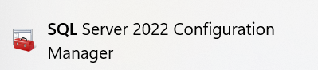
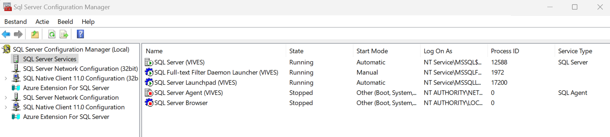
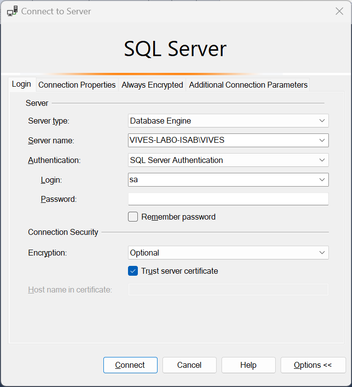
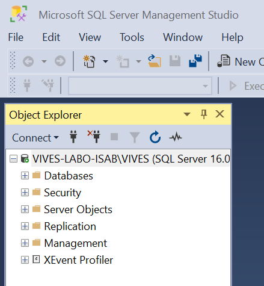

# Configuratie

## SQL Server Configration manager
SQL Server draait als een service op je computer. Je kan deze beheren via MQL Server 2022 Configuration Manager.

Als de configiration manager opgestart is, krijg je onderstaand scherm te zien en zien we welke services er draaien.

Na onze installatie zie je ondermeer volgende services:
* SQL Server (VIVES): de benoemde instantie van de SQL Server, deze is standaard actief
* SQL Server Agent (VIVES): deze is eigenlijk nutteloos, want je kan deze niet starten
* SQL Server Browser: deze levert de interface met het netwerk

Op één computer kunnen tot 16 instanties van SQL Server Express draaien. De verschillende instanties bevatten dan elk hun eigen databank, met hun eigen logins en gebruikers en hun eigen beveiligingscontext.

De SQL Server Browser start je enkel op als de SQL Server(s) van de computer bereikbaar moet(en) zijn over het netwerk.

## SQL Server Management Studio
Je databanken zelf beheer je via een tool nm Sql Server Management Studio. Je kan deze tool opstarten door in windows het commando <strong>SSMS</strong> te typen.

Met de Sql Server Management Studio Express kan je onder meer volgende zaken doen:
* Serverinstellingen wijzigen
* Databanken maken/verwijderen/beheren
* Logins, gebruikers, machtigingen, toegang instellen
* Alle databank objecten maken en beheren
* Policies instellen
* SQL scripts samenstellen

Na het opstarten van SQL Server Manager Studio wordt je gevraagd om in te loggen.
Je kiest hier voor SQL authentication met de gebruikersnaam en paswoord dat je hebt ingegeven tijdens de installatie.
(Standaard zijn dit volgende gegeven. gebruikersnaam: sa, paswoord: Vives2024?)

Na het inloggen krijgen we het eigenlijke beginscherm te zien

## Koppelen van een bestaande databank